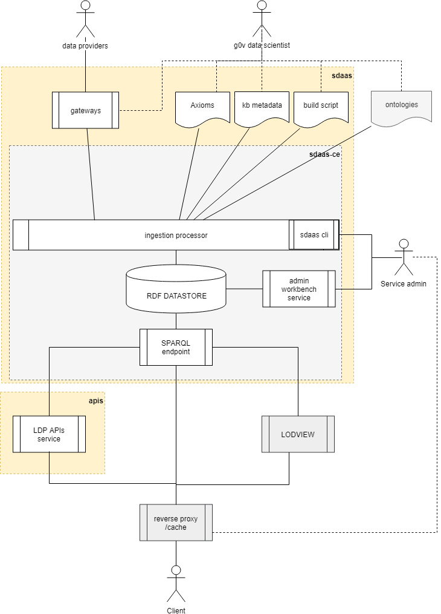

# g0v-inps

A simple smart data management platform to feed http://inps.g0v.it/ web application. 

This project aims to create a general smart data management platform to feed a budget visualization application based on W3C Semantic Web standards.

**Public resources**

- **api**: https://data.inps.g0v.it/api/v1
- **SPARQL endpoint**: https://data.budget.g0v.it/sdaas

## Development

The project contains the following logical components:

- **sdaas** (smart data as a service):  the data management platform core providing a RDF store, a [SPARQL endpoint](https://www.w3.org/TR/sparql11-overview), a data ingestion engine, a set of gateways to transform raw data in linked data and a build script that populates the RDF store. See files and docs in [sdaas directory](sdaas/README.md)
- a set of **apis** that query the SPARQL endpoint and produce json data with a schema suitable to be used with the [vue-budget component project](). See files and docs in [apis directory](apis/README.md)
- a **router** that provides redirects and caching to the platform services.
 
This picture shows the components interactions:

The platform deploy requires a stack of some services (e.g. docker containers):

The platform is shipped with a [Docker](https://docker.com) setup that makes it easy to get a containerized development
environment up and running. If you do not already have Docker on your computer, [it's the right time to install it](https://docs.docker.com/install/).

clone this project, open a terminal, and navigate to the directory of this repository. Copy the env.dist file in .env (`cp env.dist .env`), edit .env file according your needs. Do not save the .env file in the repository.

To start all services using [Docker Compose](https://docs.docker.com/compose/) type: `docker-compose up -d`

This starts the following services

| Name        | Description                                                   | Port(s) 
| ----------- | ------------------------------------------------------------- | ------- 
| router      | proxy cache server                                            | 80      
| sdaas       | a server that manages the datastore and the ingestion engine  | 8889    
| api         | a server that manages the web-budget api                      | 8081   

The first time you start the containers, Docker downloads and builds images for you. It will take some time, but don't worry
this is done only once. Starting servers will then be lightning fast

To see the container's logs, run `docker-compose logs -f`

### Entry points 

The router acts as a redirector and as a transparent proxy for all the data management platform services. It provides following entry points:

- **/** redirects to the project home page (this readme file)
- **/api/** redirects to api documentation
- **/api/v1/<api command>*** redirects to api command  (try http://localhost/api/accounts)
- **/sdaas/sparql** redirects to sparql endpoint  (try http://localhost/sdaas/sparql)

## Support

For answers you may not find in here or in the Wiki, avoid posting issues. Feel free to ask for support on the [Slack](https://copernicani.slack.com/) general room. Make sure to mention **@enrico** so he is notified

## Credits

- data extracted from [INPS Open Data portal](https://www.inps.it/nuovoportaleinps/default.aspx?iIDLink=103) with [IODL](http://www.dati.gov.it/iodl/2.0/) open license
- the RDF datastore and the SPARQL endpoint is based on the [Blazegraph community edition](https://www.blazegraph.com/
- the Smart Data Management Platform was developed by [Enrico Fagnoni](https://github.com/ecow) using the [SDaaS platform by LinkedData.Center](http://LinkedData.Center/)
- API server was developed by [Yassine Ouahidi](https://github.com/YassineOuahidi)

Thanks to all project contributors, to the [Copernicani community](https://copernicani.it/) and to the [g0v asia community](http://g0v.asia) for ideas and support.

## License

The MIT License (MIT). Please see [License File](LICENSE) for more information.

